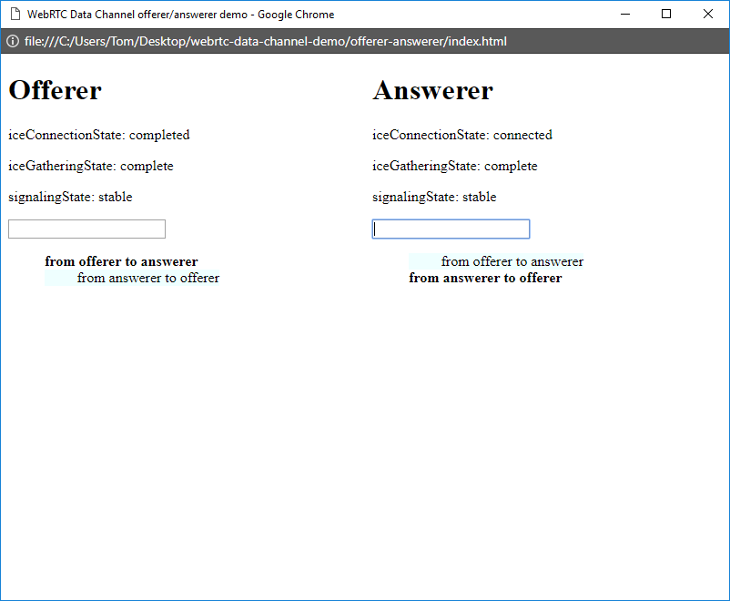
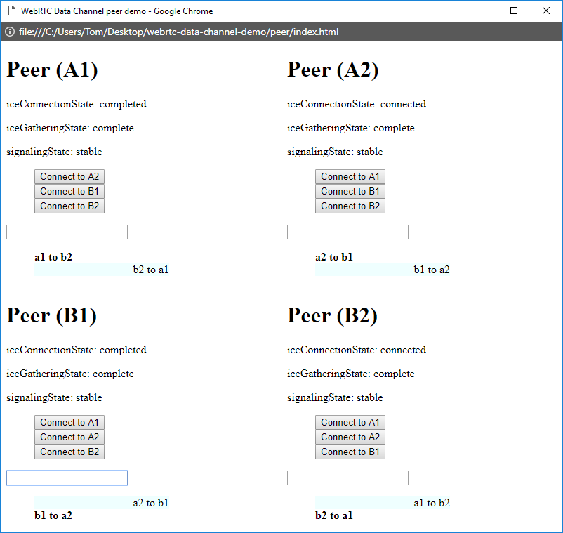

# WebRTC Data Channels Example

A simple example of WebRTC Data Channels.
Uses [`postMessage()`](https://developer.mozilla.org/en-US/docs/Web/API/Window/postMessage) as a substitute for a real signalling channel.

I've made this because I was frustrated with the lack of good WebRTC data channel examples and tutorials online.

The code should be self-explanatory when following MDN on the side. There is only one gotcha and it is documented/commented. Following the Console messages in Developer Tools should make it clear what happens and when.

## Offerer-answerer Mode

[Demo on Bloggo](https://bloggo.herokuapp.com/webrtc-data-channel-demo/src/offerer-answerer/)

- Unix: `open offerer-answerer/index.html`
- Windows: `start offerer-answerer/index.html`
- Chrome Test: `./cmd/chrome-screenshot/cmd.sh offerer-answerer`
- Firefox Test: `./cmd/firefox-screenshot/cmd.sh offerer-answerer`

In this demo, there are two separate files for offerer and answerer so that who does what when establishing a connection is clearly separated.

[Google Chrome Console output from this demo](/src/offerer-answerer/console.log)

## Native to Web Mode

- Native application is offerer, web application is answerer
- Native application is answerer, web application is offerer

[See more](src/native-to-web/README.md)

## Peer Mode

[Demo](https://tomashubelbauer.github.io/webrtc-data-channel-demo/src/index.html)

- Unix: `open peer/index.html`
- Windows: `start peer/index.html`
- Chrome Test: `./cmd/chrome-screenshot/cmd.sh peer`
- Firefox Test: `./cmd/firefox-screenshot/cmd.sh peer`

In this demo, each peer is capable of being either an offerer or an answerer. The flows for both are intertwined. Less clear but more real-life.

[Google Chrome Console output from this demo](/src/peer/console.log)

## Support

This example is written using latest JavaScript features available in:

- Chrome 63+
- Firefox 58+

It does not use anything else and runs off the `file` protocol.

## Scripts

Chrome screenshot capture:

- `./cmd/chrome-screenshot/cmd.sh peer`
- `./cmd/chrome-screenshot/cmd.sh offerer-answerer`

Firefox screenshot capture (in development):

- `./cmd/firefox-screenshot/cmd.sh peer`
- `./cmd/firefox-screenshot/cmd.sh offerer-answerer`

## Contributing

Please review the codebase and do not hesitate to open an issue or a PR with questions or
proposed changes. PRs in the spirit of this excercise will be merged, PRs adding fluff that
has no direct impact on understanding the data channels flow (like adding alternative
signalling channel mechanism which work the same way the current one does, adding bundlers
etc.) will be respectfully declined.

## To-Do

### Fix nvm: command not found in cmd/chrome-screenshot/cmd.sh and cmd/firefox-screenshot/cmd.sh

### Finalize Firefox headless automation for generating screenshots and console logs using Selenium WebDriver

### Contribute a demo where peer connections are keyed by peer name and one peer can hold multiple ones or a group chat

### Extend the/contribute a new example to cover media session establishment on top of the data one

### Consider adding another demo where the signaling channel is a service worker connecting two tabs
