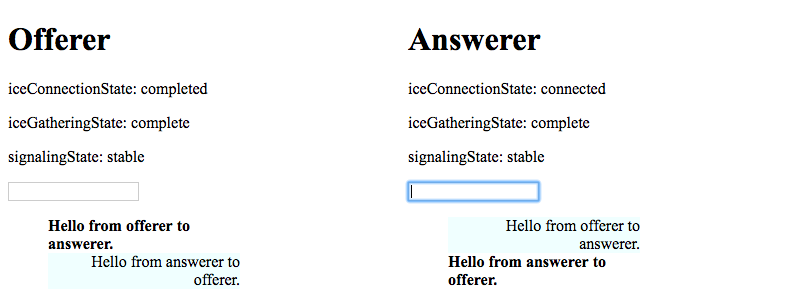
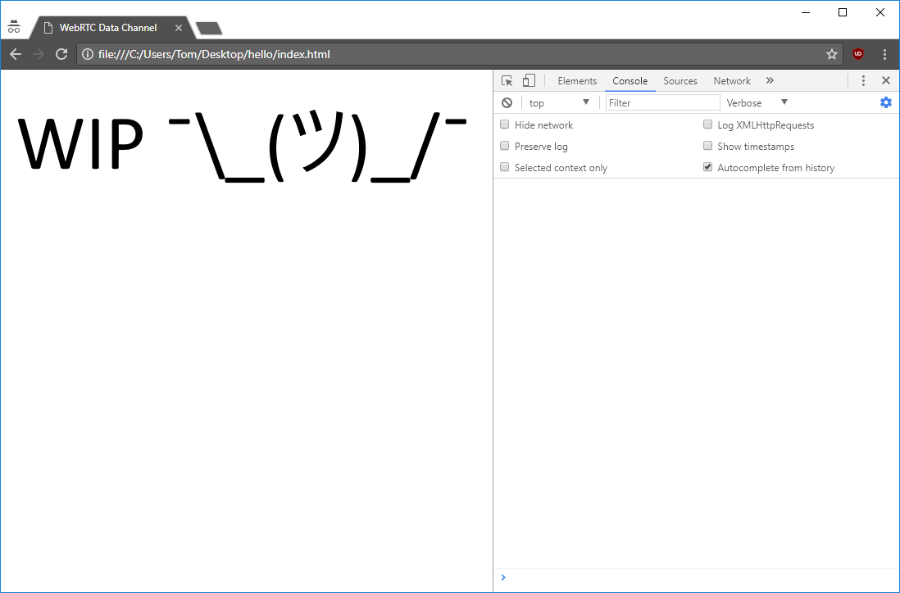

# WebRTC Data Channels Example

A simple example of WebRTC Data Channels.
Uses [`postMessage()`](https://developer.mozilla.org/en-US/docs/Web/API/Window/postMessage) as a substitute for a real signalling channel.

I've made this because I was frustrated with the lack of good WebRTC data channel examples and tutorials online.

The code should be self-explanatory when following MDN on the side. There is only one gotcha and it is documented/commented. Following the Console messages in Developer Tools should make it clear what happens and when.

## Offerer-answerer mode

`open offerer-answerer/index.html`

In this demo, there are two separate files for offerer and answerer so that who does what when establishing a connection is clearly separated.

## Peer mode

`open peer/index.html`

In this demo, each peer is capable of being either and offerer or an answerer. The flows for both are intertwined. Less clear but more real-life.

## Support

This example is written using latest JavaScript features available in:

- Chrome 63+
- Firefox 58+

It does not use anything else and runs off the `file` protocol.

## Contributing

Please review the code-base and do not hesitate to open an issue or a PR with questions or proposed changes. PRs in the spirit of this excercise will be merged, PRs adding fluff that has no direct impact on understanding the data channels flow (like adding alternative signalling channel mechanism which work the same way the current one does, adding bundlers etc.) will be respectfully declined.
