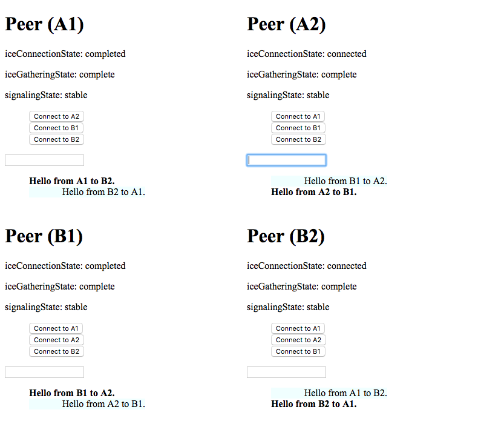

# WebRTC Data Channel Demo

`postMessage`: https://developer.mozilla.org/en-US/docs/Web/API/Window/postMessage

A demo of WebRTC Data Channel using [`postMessage`] for a signalling channel.

I made this because I was frustrated with the lack of good WebRTC data channel
examples and tutorials online. Most use the JavaScript context of the browser
tab as a signalling channel which I did not like.

I have implemented two modes of work explained below.

## [Offerer-Answerer](https://tomashubelbauer.github.io/webrtc-data-channel-demo/offerer-answerer)

In this demo, the offerer and answerer roles and implemented in separate files.
This means the implementation is not versatile, but it is much easier to follow.

## [Peer](https://tomashubelbauer.github.io/webrtc-data-channel-demo/peer)

In this demo, each peer is capable of being either an offerer or an answerer.
The flows for both are intertwined. Less clear but more real-life.

## To-Do

### Contribute a demo where peer connections are keyed by peer name

This will enable one peer can hold multiple connections in a group chat.

### Make another demo a service worker signaling channel between two tabs
